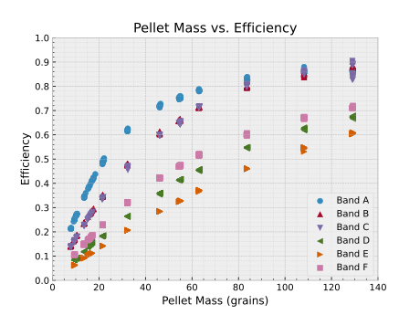
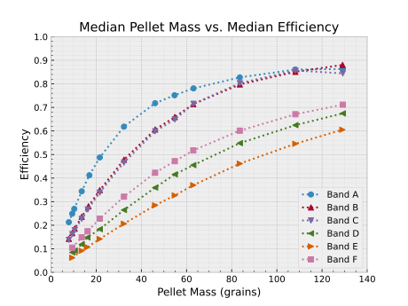
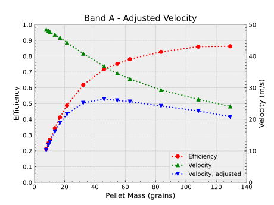

# Introduction

This experiment was conducted mostly for my own curiosity, but also because I have not found any data to back up the following assertion from [simple-shot](https://simple-shot.com/blogs/news/match-slingshot-band-sets-to-ammo):

> If you don't match your bands to your ammo, you'll waste energy, decrease your band life and have hand slap (OTT).

The source for this assertion, Simple-Shot, sells a variety of slingshot bands ostensibly "matched" to a particular ammunition type. The types of ammunition are either Steel or Clay pellets of a specified diameter. This experiment will only focus on the "you'll waste energy" assertion. I am defining an "energy waste" as a drop in efficiency when converting potential energy to kinetic energy. Also, while Simple-Shot characterizes the pellets using material and diameter, I will use the pellet's mass.

# Materials & Methods

## Materials

### Slingshot Bands

All bands used for this experiment were purchased from Simple-Shot's, using their bundle which includes every band they sell.

| Band   | Steel (Metric) | Steel (US) | Clay             | Thickness | Taper                  |
| ------ | -------------- | ---------- | ---------------- | --------- | ---------------------- |
| Band A | 6.5 mm         | 1/4"       | 10 mm            | 0.4 mm    | 8 mm x 12 mm x 270 mm  |
| Band B | 8 mm           | 5/16"      | n/a              | 0.5 mm    | 12 mm X 18 mm x 270 mm |
| Band C | n/a            | n/a        | yes, unspecified | 0.6 mm    | 12 mm x 18 mm x 270 mm |
| Band D | 11 mm          | 7/16"      | n/a              | 0.7 mm    | 18 mm X 22 mm x 270 mm |
| Band E | 12.5 mm        | 1/2"       | n/a              | 0.7 mm    | 25 mm x 30 mm x 270 mm |
| Band F | 9.5 mm         | 3/8"       | n/a              | 0.7 mm    | 21 mm x 16 mm x 270 mm |

Band F did not report any thickness and taper dimensions. The dimensions listed in the table were measured.

### Ammunition

This experiment will use both steel and clay pellets. The clay pellets are advertised as 3/8" diameter. The steel balls used are sold with a stated diameter using a combination of metric and imperial. The metric diameters are 4.5, 5, 5.5, 6, 7, 8, 9, 10, 11, and 12 mm. The imperial diameters are 3/8" or 1/2". These diameters correspond to 9.525 mm (shortened to 9.5 mm) and 12.7 mm.

### Measurement Devices

All measurement devices are inexpensive and consumer-grade.

| Device        | Description                                                                                                                   |
| ------------- | ----------------------------------------------------------------------------------------------------------------------------- |
| scale, small  | range 0-200 grains, with a 0.1 grain display resolution                                                                       |
| Archery scale | measures in kilograms, with a 0.01 kg display resolution                                                                      |
| Chronograph   | "light-curtain" style chronograph with an advertised range of 4-6500 ft/s. Used in m/s mode. Has a 0.1 m/s display resolution |

### Test Fixture

The test fixture has three major parts:

1. slingshot
2. chronograph
3. catch box

The slingshot was constructed using a Simple-Shot Hammer XT slingshot head, a wooden beam, an aluminum extrusion, a release aid device, and 3D-printed adapters. There is no great significance to the specific materials used; they are what I already had on-hand. The goal is to remove human inconsistencies. Particularly, it enables a consistent draw length and release. There are holes drilled in the wood to allow draw lengths from 0.4-0.88 m in 20 mm increments.

The slingshot will shoot through the chronograph, which is placed just in front of the slingshot. After passing through the chronograph, the projectile will enter the catch box.

## Methods

This experiment was conducted indoors, at an ambient temperature of approximately 21°C. Each band will be attached to the fork using its maximum available length. The draw length will be measured as the distance from the front of the fork to the center of the projectile, and will be fixed at 0.8 m. The draw force of each band will be measured in kilogram-force, and converted to Newtons for calculations. For each band, the slack-length of the band will be recorded. For each band, each projectile type will be shot N times.

Each shot will consist of the following steps:

1. the projectile will be weighed and recorded in grains.
2. the projectile will be inserted into the band's pouch
3. the pouch and pellet will be drawn back to, and placed into the release aid
4. the slingshot will be aimed through the chronograph, into the catch box.
5. the release aid's trigger will be pulled
6. the velocity of the projectile will be determined and recorded in m/s.

### Calculating Potential Energy

I will consider the slingshot band as an ideal linear spring. The potential energy of such a spring is $U(x) = \frac{1}{2}kx^2$ where `k` is the spring constant, and `x` is the deformation of the spring. However, because `k` is unknown, we can take Hooke's Law, and solve for `k`

```math
F = kx
```

```math
k = \frac{F}{x}
```

Plugging `k` in to the formula for potential energy, and simplifying yields: $U(x) = \frac{1}{2}Fx$ where `F` is measured in Newtons, and `x` is measured in meters. Because the band was not drawn from `x=0`, `x` is actually the _change_ in draw length, which yields the final equation $U(x) = \frac{1}{2}F\Delta x$

### Calculating Kinetic Energy

Kinetic energy of the projectile will be calculated using $E = \frac{1}{2}mv^2$ where `m` is the mass of the projectile in kilograms, and `v` is the velocity of the projectile in m/s.

### Assumptions

1. the draw-weight of each band will not change between shots
2. the slack length of each band will not change between shots
3. the final draw length of each shot will not change between shots
4. the effect of air resistance is ignored
5. each band acts as an ideal spring, having a linear stress-strain curve

# Results

My data does not support the "you'll waste energy" assertion. If the assertion, and my assumption of what "efficient" means in this context was correct, I would have expected a peak in the mass vs. efficiency graph at specific mass. Specifically, I would have expected the peak to correspond to the mass of the pellet type listed. For reference, the mapping of each band to pellet type/diameter, and approxomate measured mass is shown below.

| Band   | Steel Diameter  | Approxomate mass (grains) |
| ------ | --------------- | ------------------------- |
| Band A | 0.25" or 6.5mm  | 14                        |
| Band B | 0.3125" or 8mm  | 32                        |
| Band C | n/a (clay)      | 16-17                     |
| Band D | 0.4375" or 11mm | 83                        |
| Band E | 0.5" or 12.7mm  | 129                       |
| Band F | 0.375" or 9.5mm | 55                        |

If the assertion were true, there would be noticable peaks in the following graphs. However, they show the peak efficiency for _all_ bands is at a mass corresponding to 12mm or 0.5in.





# Discussion

There are several possibilities for why my results differ from expectations.

1. my definition of efficiency differs from Simple-Shot's.
2. one or more of my assumptions is incorrect
3. experimental design errors

First, lets look at the consistency of my data.

## Data tables

This table contains links to summary tables for each band-pellet combination run. The goal is to indicate how consistent my data is with itself, and to attempt to calculate confidence intervals for the measured statistics. In general, the data is what I would characterize as consistent.

Not all values used or calculated were analyzed. The data not shown are either constants (such as draw length, draw force, etc.), or are values derived solely from constant values (such as power stroke, and potential energy, etc.). This data has 0 spread, which may mislead one to interpret the data as more consistent than it is. All these values are still included in the data file (`SS-BAM - data.csv`). The 5mm pellets were unable to be held by the release aid for Bands D, E, and F, and the 5.5mm pellets for Bands E and F. In some cases, standard deviations and/or confidence intervals are 0.0. This is due to my rounding the values to 3 decimal places.

|        | Band A                                         | Band B                                         | Band C                                         | Band D                                         | Band E                                         | Band F                                         |
| ------ | ---------------------------------------------- | ---------------------------------------------- | ---------------------------------------------- | ---------------------------------------------- | ---------------------------------------------- | ---------------------------------------------- |
| ½ inch | [table](tables/band-a-1-2-inch-steel-stats.md) | [table](tables/band-b-1-2-inch-steel-stats.md) | [table](tables/band-c-1-2-inch-steel-stats.md) | [table](tables/band-d-1-2-inch-steel-stats.md) | [table](tables/band-e-1-2-inch-steel-stats.md) | [table](tables/band-f-1-2-inch-steel-stats.md) |
| 12 mm  | [table](tables/band-a-12-mm-steel-stats.md)    | [table](tables/band-b-12-mm-steel-stats.md)    | [table](tables/band-c-12-mm-steel-stats.md)    | [table](tables/band-d-12-mm-steel-stats.md)    | [table](tables/band-e-12-mm-steel-stats.md)    | [table](tables/band-f-12-mm-steel-stats.md)    |
| 11 mm  | [table](tables/band-a-11-mm-steel-stats.md)    | [table](tables/band-b-11-mm-steel-stats.md)    | [table](tables/band-c-11-mm-steel-stats.md)    | [table](tables/band-d-11-mm-steel-stats.md)    | [table](tables/band-e-11-mm-steel-stats.md)    | [table](tables/band-f-11-mm-steel-stats.md)    |
| 10 mm  | [table](tables/band-a-10-mm-steel-stats.md)    | [table](tables/band-b-10-mm-steel-stats.md)    | [table](tables/band-c-10-mm-steel-stats.md)    | [table](tables/band-d-10-mm-steel-stats.md)    | [table](tables/band-e-10-mm-steel-stats.md)    | [table](tables/band-f-10-mm-steel-stats.md)    |
| ⅜ inch | [table](tables/band-a-3-8-inch-steel-stats.md) | [table](tables/band-b-3-8-inch-steel-stats.md) | [table](tables/band-c-3-8-inch-steel-stats.md) | [table](tables/band-d-3-8-inch-steel-stats.md) | [table](tables/band-e-3-8-inch-steel-stats.md) | [table](tables/band-f-3-8-inch-steel-stats.md) |
| 9 mm   | [table](tables/band-a-9-mm-steel-stats.md)     | [table](tables/band-b-9-mm-steel-stats.md)     | [table](tables/band-c-9-mm-steel-stats.md)     | [table](tables/band-d-9-mm-steel-stats.md)     | [table](tables/band-e-9-mm-steel-stats.md)     | [table](tables/band-f-9-mm-steel-stats.md)     |
| 8 mm   | [table](tables/band-a-8-mm-steel-stats.md)     | [table](tables/band-b-8-mm-steel-stats.md)     | [table](tables/band-c-8-mm-steel-stats.md)     | [table](tables/band-d-8-mm-steel-stats.md)     | [table](tables/band-e-8-mm-steel-stats.md)     | [table](tables/band-f-8-mm-steel-stats.md)     |
| 7 mm   | [table](tables/band-a-7-mm-steel-stats.md)     | [table](tables/band-b-7-mm-steel-stats.md)     | [table](tables/band-c-7-mm-steel-stats.md)     | [table](tables/band-d-7-mm-steel-stats.md)     | [table](tables/band-e-7-mm-steel-stats.md)     | [table](tables/band-f-7-mm-steel-stats.md)     |
| 6 mm   | [table](tables/band-a-6-mm-steel-stats.md)     | [table](tables/band-b-6-mm-steel-stats.md)     | [table](tables/band-c-6-mm-steel-stats.md)     | [table](tables/band-d-6-mm-steel-stats.md)     | [table](tables/band-e-6-mm-steel-stats.md)     | [table](tables/band-f-6-mm-steel-stats.md)     |
| 5.5 mm | [table](tables/band-a-5-5-mm-steel-stats.md)   | [table](tables/band-b-5-5-mm-steel-stats.md)   | [table](tables/band-c-5-5-mm-steel-stats.md)   | [table](tables/band-d-5-5-mm-steel-stats.md)   | n/a                                            | n/a                                            |
| 5 mm   | [table](tables/band-a-5-mm-steel-stats.md)     | [table](tables/band-b-5-mm-steel-stats.md)     | [table](tables/band-c-5-mm-steel-stats.md)     | n/a                                            | n/a                                            | n/a                                            |
| clay   | [table](tables/band-a-clay-stats.md)           | [table](tables/band-b-clay-stats.md)           | [table](tables/band-c-clay-stats.md)           | [table](tables/band-d-clay-stats.md)           | [table](tables/band-e-clay-stats.md)           | [table](tables/band-f-clay-stats.md)           |
| rubber | [table](tables/band-a-rubber-stats.md)         | [table](tables/band-b-rubber-stats.md)         | [table](tables/band-c-rubber-stats.md)         | [table](tables/band-d-rubber-stats.md)         | [table](tables/band-e-rubber-stats.md)         | [table](tables/band-f-rubber-stats.md)         |

## Definition of Efficiency

I defined efficiency as the ratio of kinetic energy to potential energy. However, Simple-Shot does not specify what they mean by efficiency. After reviewing my data, I thought of alternate ways of defining efficiency, and one is to plot the product of velocity and calculated energy efficiency (Adjusted Velocity) vs pellet mass, along with the original velocity and efficiency vs mass.



In the plot, you can see a soft peak in the adjusted velocity. I do not know if this meaningful, however, it _does_ show increasing peaks for a band which is marketed as for a larger pellet. However, these peaks do not match Simple-Shot's recommendation. Plots for the remaining band are linked below, but the "peak" isn't visible because I capped the pellet mass to ~130 grains.

remaining charts: [Band A](charts/Band_A_adjusted_velocity_efficiency.svg), [Band B](charts/Band_B_adjusted_velocity_efficiency.svg), [Band C](charts/Band_C_adjusted_velocity_efficiency.svg), [Band D](charts/Band_D_adjusted_velocity_efficiency.svg), [Band E](charts/Band_E_adjusted_velocity_efficiency.svg), [Band F](charts/Band_F_adjusted_velocity_efficiency.svg)

## Incorrect Assumptions

I made some [assumptions](#assumptions), which I will examine in more detail.

### Assumption #1

> the draw-weight of each band will not change between shots

It is possible the band force changed between shots, either due to the relatively rapid shooting, or some kind of "break-in" process. I do not think this is the case. If it were, I would have expected a time-based trend in the measured velocities. Alternatively, if the band force wasn't constant, it was too minor to be measured with my instruments.

### Assumption #2

> the slack length of each band will not change between shots

It is possible the band's slack length changed. However, like with assumption #1, if there was some effect not accounted for, I would have expected a time-based trend in the measured velocities, which I did not see. Just like Assumption #1, it is possible such an effect was present, but if it was, again, it was too minor to be measured.

### Assumption #3

> the final draw length of each shot will not change between shots

I do not think this assumption is incorrect. While there is undoubtedly some deformation in the test fixture, I do not think the forces involved are enough to significantly bend or deform the PLA, wood, steel, or aluminum used in it. 

### Assumption #4

> the effect of air resistance is ignored

Obviously this assumption is not correct, but it is a common assumption made for the sake of simplicity. While incorrect, this assumption is likely not an issue, and I suspect at the low velocities I've measured, it would not be significant.

### Assumption #5

> each band acts as an ideal spring, having a linear stress-strain curve

for calculating the potential energy of the slingshot, while I measured the draw force at full draw, I did not measure it at other draw distances. However, the calculated potential energy and the actual stress-strain curve arent changing shot to shot (assumptions 1-3), so while my data may have an error factor to it, it should be consistent for a single band.

It is also possible the draw and slack lengths used are somehow non-ideal and are masking  

## Experimental Design Errors

I did my best to ensure data consistency with the instruments and materials available to me within my budget and skill level. Despite this, as a team of 1, it is entirely possible I've designed my experiments with fundamental flaws I'm unaware of, or do not understand.

# Conclusion

I started this experiment out of curiousity, anticipating I might confirm Simple-Shot's assertion that band and ammunition should be matched.  My results do not support their claims, but it also does not suggest an alternate ideal matching. Generally speaking, I found that for a single band, the heaviest pellets yeilded the most efficient energy transfer, and for a single pellet size, the lightest band was the most efficient.

## Places for Improvement:

1. use known accurate measurement devices
2. use a more purpose-built test fixture
    - incorporate a load cell for measuring the stress-strain curve
3. use data-collection software to remove manual data entry
